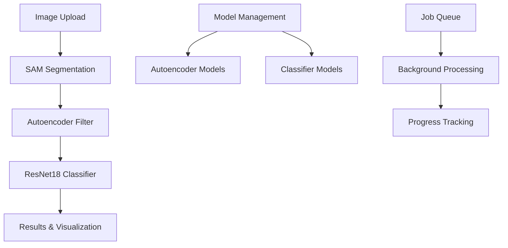

# OliveGuard AI - Advanced Olive Tree Disease Detection

🌿 **AI-powered olive tree disease detection system using computer vision and machine learning.**

## 🚀 Features

- **Image Upload & Analysis**: Upload single/multiple images or ZIP files for batch processing
- **Real-time Job Tracking**: Monitor analysis progress with live status updates
- **AI-Powered Detection**: Uses Segment Anything Model (SAM) + Autoencoder + ResNet18 pipeline
- **Model Management**: Upload, switch, and manage different AI model versions
- **Results Visualization**: View predictions with confidence scores and ROI thumbnails
- **Parameter Configuration**: Adjust segmentation thresholds and filtering parameters
- **Professional Dashboard**: Comprehensive analytics and reporting interface
- **Responsive Design**: Works perfectly on desktop, tablet, and mobile devices
- **Dark/Light Theme**: Automatic theme switching based on system preferences

## 🏗️ Architecture



### Technology Stack

**Frontend:**
- React 18 + TypeScript
- Vite for fast development
- Tailwind CSS + shadcn/ui components
- React Query for state management
- React Router for navigation

**Design System:**
- Agricultural green theme with semantic tokens
- Responsive layouts with mobile-first approach
- Beautiful gradients and shadows
- Smooth animations and transitions

## 🎨 Design Philosophy

OliveGuard AI features a nature-inspired design system:

- **Green Palette**: Evokes agriculture and plant health
- **Professional Interface**: Clean, technical design for researchers and farmers
- **Data Visualization Focus**: Clear presentation of analysis results
- **Accessibility**: High contrast ratios and semantic HTML

## 📁 Project Structure

```
src/
├── components/
│   ├── ui/                    # shadcn/ui components
│   ├── dashboard/             # Dashboard-specific components
│   ├── upload/                # File upload components
│   └── jobs/                  # Job management components
├── pages/
│   ├── Dashboard.tsx          # Main dashboard with statistics
│   ├── Upload.tsx             # Image upload and analysis
│   ├── Models.tsx             # AI model management
│   ├── Settings.tsx           # User settings and configuration
│   └── Login.tsx              # Authentication page
├── assets/                    # Images and static files
├── hooks/                     # Custom React hooks
└── lib/                       # Utility functions
```

## 🔧 Development Setup

### Prerequisites

- Node.js 18+ and npm
- Modern web browser

### Installation

```bash
# Clone the repository
git clone <YOUR_GIT_URL>
cd oliveguard-ai

# Install dependencies
npm install

# Start development server
npm run dev
```

The application will be available at `http://localhost:5173`

### Build for Production

```bash
# Create production build
npm run build

# Preview production build locally
npm run preview
```

## 📱 Usage Guide

### 1. Dashboard
- View analysis statistics and trends
- Monitor recent jobs and their status
- Quick access to upload and reports

### 2. Upload & Analysis
- **Upload Images**: Drag & drop or browse for JPG/PNG files or ZIP archives
- **Configure Parameters**:
  - Segmentation: Min/max area thresholds
  - Filtering: Autoencoder threshold settings
  - Classification: Select AI model version
- **Start Analysis**: Process images and track progress

### 3. Model Management
- **Upload Models**: Add new autoencoder or classifier models (.pt/.pth files)
- **Switch Models**: Activate different model versions
- **Performance Metrics**: View accuracy and model statistics

### 4. Settings
- **Profile**: Update account information and preferences
- **Notifications**: Configure email alerts and system notifications
- **API Access**: Manage API keys for programmatic access
- **System Info**: View storage usage and system status

## 🔐 Authentication

Currently uses demo authentication:
- Email: Any valid email address
- Password: Any password

For production deployment, integrate with your preferred authentication provider.

## 🎯 Key Components

### FileUploadZone
Advanced drag-and-drop file upload with:
- Multiple file support
- File type validation
- Progress tracking
- Error handling

### StatsCard
Beautiful statistics display with:
- Gradient backgrounds
- Trend indicators
- Icon integration
- Hover effects

### JobStatusBadge
Dynamic status indicators for:
- Queued jobs
- Running analysis
- Completed tasks
- Failed processes

### Navigation
Responsive navigation with:
- Active route highlighting
- User profile dropdown
- Mobile-friendly design

## 🎨 Design System

### Colors
- **Primary**: Olive green (#59981A) for main actions
- **Success**: Forest green (#16A34A) for completed states
- **Warning**: Amber (#EAB308) for attention states
- **Muted**: Subtle grays for secondary content

### Components
All components use semantic design tokens from the design system:
- No hardcoded colors in components
- Consistent spacing and typography
- Responsive breakpoints
- Smooth transitions

### Gradients & Effects
- **Primary Gradient**: Olive to forest green
- **Card Gradients**: Subtle background variations
- **Shadow System**: Elegant shadows with glow effects
- **Hover States**: Interactive feedback

## 🔄 Pipeline Integration

The frontend is designed to integrate with your existing Python pipeline:

```python
# Your existing modules
from oliveguard.scripts import segment_folder
from oliveguard.scripts import train_autoencoder
from oliveguard.scripts import filter_masks
from oliveguard.scripts import train_classifier
from oliveguard.pipeline import run_pipeline
```

### Expected API Endpoints

```typescript
// Job management
POST /api/v1/jobs              // Create new analysis job
GET  /api/v1/jobs              // List jobs
GET  /api/v1/jobs/{id}         // Get job details
GET  /api/v1/jobs/{id}/results // Download results

// Model management  
POST /api/v1/models/autoencoder    // Upload autoencoder
POST /api/v1/models/classifier     // Upload classifier
GET  /api/v1/models                // List models

// Authentication
POST /api/v1/auth/login        // User login
POST /api/v1/auth/logout       // User logout
```

## 🚀 Deployment

### Environment Variables

Create `.env` file:

```bash
VITE_API_BASE_URL=https://your-api-server.com
VITE_APP_NAME=OliveGuard AI
```

### Production Checklist

- [ ] Configure API endpoints
- [ ] Set up authentication provider
- [ ] Configure file storage (S3/MinIO)
- [ ] Set up monitoring and analytics
- [ ] Configure SSL certificates
- [ ] Test mobile responsiveness
- [ ] Verify accessibility compliance

## 🔍 SEO & Performance

### SEO Features
- Semantic HTML structure
- Meta tags and Open Graph
- Structured data ready
- Mobile-optimized
- Fast loading times

### Performance Optimizations
- Code splitting with React.lazy
- Image optimization and lazy loading
- Efficient bundle sizes
- Service worker ready

## 📊 Analytics Integration

Ready for analytics integration:
- Event tracking for user actions
- Performance monitoring
- Error tracking
- User journey analysis

## 🤝 Contributing

1. Fork the repository
2. Create a feature branch: `git checkout -b feature-name`
3. Make your changes
4. Add tests if applicable
5. Commit changes: `git commit -m 'Add feature'`
6. Push to branch: `git push origin feature-name`
7. Submit a pull request

## 📄 License

This project is licensed under the MIT License - see the LICENSE file for details.

## 🆘 Support

For support and questions:
- 📧 Email: support@oliveguard.ai
- 📖 Documentation: [docs.oliveguard.ai](https://docs.oliveguard.ai)
- 🐛 Issues: Create an issue in this repository

---

**OliveGuard AI** - Protecting olive groves with artificial intelligence 🌿🤖